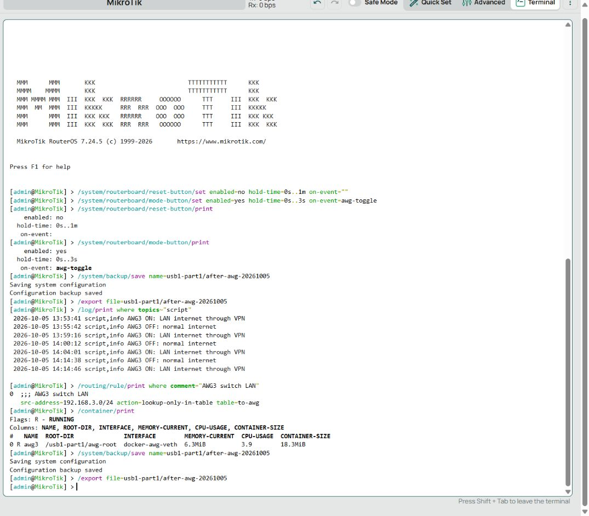
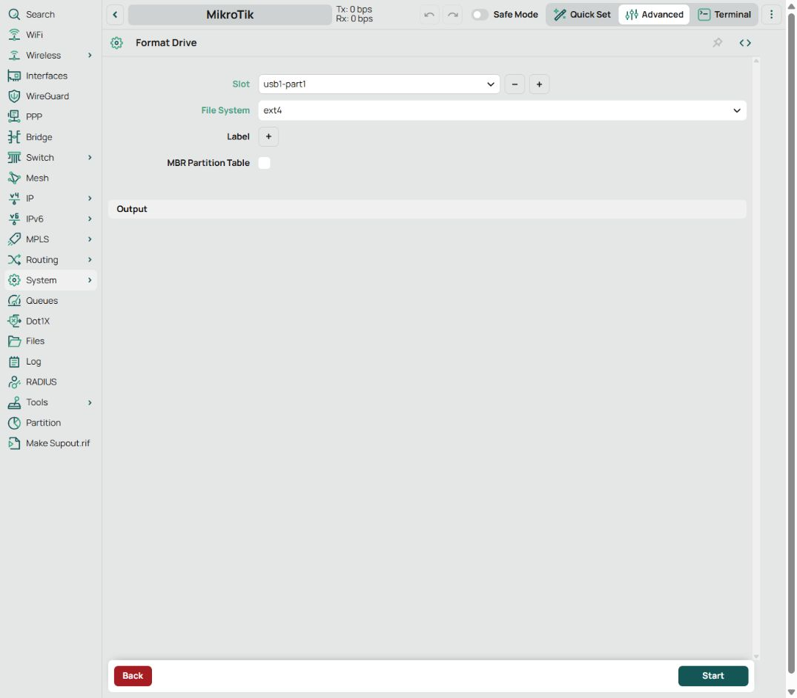
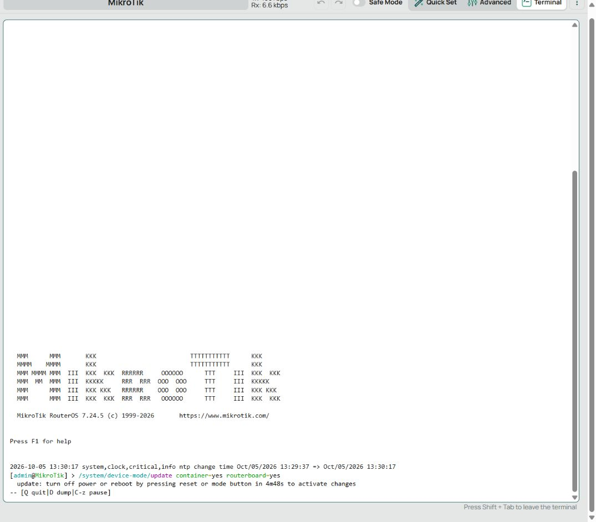
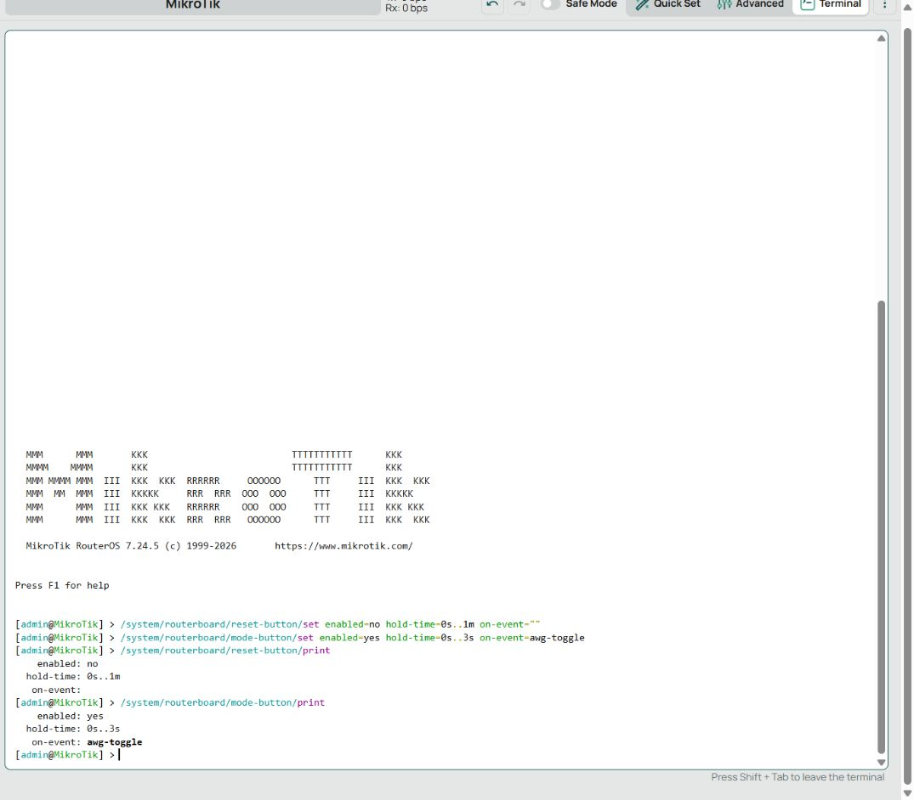

# AmneziaWG 3 на MikroTik hAP ac²

Подключил hAP ac² за домашним роутером, восстановил обычный интернет, обновил RouterOS и поднял AmneziaWG 3.1 в контейнере на USB-флешке. Интернет устройств за MikroTik идёт через VPN, а короткое нажатие **Mode рядом с USB** переключает его обратно на обычный канал.

Использовали отдельный AWG-клиент в контейнере: штатный интерфейс WireGuard RouterOS не обрабатывает эти параметры обфускации.

Ниже — команды, места в WebFig, ошибки, которые встретились при настройке, и скачиваемые скрипты. Для повторения сделал мастер: одна команда на компьютере, несколько вопросов, проверка туннеля и включение маршрутизации. При ошибке он сохраняет диагностику и пытается вернуть свои сетевые изменения.


## Что получилось и на чём проверено

| Компонент | В этой установке |
|---|---|
| Роутер | MikroTik hAP ac², ARMv7, 128 MiB RAM, 16 MiB встроенной flash |
| RouterOS | Начинали с 7.18.2, итоговая настройка работает на **7.24.5 stable** |
| Пакеты | `routeros`, `wireless`, `container` одной версии |
| WAN | `ether1`, DHCP от домашнего роутера `192.168.1.1` |
| Адрес MikroTik со стороны WAN | `192.168.1.135/24` |
| LAN | `bridge`, `192.168.3.1/24`, устройства в `192.168.3.0/24` |
| USB | SanDisk 64 GB, раздел `usb1-part1`, ext4 |
| Контейнер | `awg3`, интерфейс `docker-awg-veth` |
| Сеть контейнера | MikroTik `172.18.20.1/30`, контейнер `172.18.20.2/30` |
| Политика | Весь **IPv4-интернет LAN** через AWG; частные сети доступны через `main` |
| Переключатель | Физическая **Mode у USB**, не Reset/WPS у питания |

Включение и выключение проверили на LAN-устройстве: внешний IP действительно менялся. Журнал зафиксировал оба нажатия, а контейнер после включения потреблял примерно 6.3 MiB RAM. Скорость под нагрузкой отдельно не измеряли.



Скриншот показывает `R` у контейнера, активное правило LAN и записи `AWG3 OFF` / `AWG3 ON`. Это реальные результаты настройки, а не макет интерфейса.

## Быстрый вариант: мастер установки

**Команды ниже выполняются в терминале компьютера.** RouterOS не является обычным Linux: в его терминале нет `curl`, `bash` и такого интерактивного мастера. Компьютер скачивает установщик, задаёт вопросы и выполняет RouterOS-команды по SSH, а файлы передаёт по SFTP.

Перед первым запуском нужны:

1. hAP ac² с RouterOS **7.24.5**, обычным работающим интернетом, WAN через DHCP и базовыми firewall/NAT.
2. Пакет `container` той же версии. Обновление прошивки и удаление `wireless` мастер не выполняет.
3. Разрешённые `container=yes` и, для кнопки, `routerboard=yes` в device-mode. Физическое подтверждение описано ниже.
4. USB-флешка. Если выбранный раздел не ext4, мастер предложит форматирование и потребует ввести `ERASE usb1-part1`: **данные раздела будут удалены**.
5. Python 3.10+ на компьютере, SSH-доступ к MikroTik и свой AWG `.conf`. Сначала удобнее подключить компьютер к LAN MikroTik.

Это профиль для указанной модели и версии. Он останавливается на другой архитектуре/версии, активном IPv6-интернете, существующей policy routing, правилах `raw` или уже установленных контейнерах: такие конфигурации требуют отдельной интеграции.

### Linux / macOS

```bash
curl -fsSL https://raw.githubusercontent.com/william-aqn/microtik-awg3-installer/main/install.sh -o awg-install.sh && bash awg-install.sh
```

### Windows PowerShell

```powershell
curl.exe -fSL https://raw.githubusercontent.com/william-aqn/microtik-awg3-installer/main/install.ps1 -o awg-install.ps1; if ($LASTEXITCODE -eq 0) { powershell -NoProfile -ExecutionPolicy Bypass -File .\awg-install.ps1 }
```

`ExecutionPolicy Bypass` относится к этому запуску PowerShell, постоянную политику системы команда не меняет. Python устанавливается отдельно с [python.org](https://www.python.org/downloads/). Paramiko установщик помещает в отдельное виртуальное окружение, системные Python-пакеты не трогает.

Все вопросы, сообщения и справка скриптов написаны на английском; исполняемые файлы содержат только ASCII. Мастер спрашивает LAN-подсеть, имя bridge, WAN, USB-раздел, путь к конфигу и адрес роутера. Пароль вводится скрыто, в аргументы команд и отчёты не записывается. При первом SSH-подключении нужно проверить и подтвердить отпечаток ключа; сохранённый ключ при последующих запусках проверяется, его неожиданная замена вызывает ошибку.

Можно сразу указать параметры. Для описанной схемы:

```powershell
.\awg-install.ps1 -HostName 192.168.3.1 -Config 'S:\cfg\my-vpn.conf' -Lan 192.168.3.0/24 -Bridge bridge -Wan ether1 -Disk usb1-part1
```

Для доступа из сети верхнего роутера вместо `192.168.3.1` нужен WAN-адрес MikroTik и отдельное разрешение SSH именно с компьютера управления. Мастер не открывает управление через WAN.

Установщик читает один `[Interface]` и один `[Peer]`, проверяет ключи и полный `AllowedIPs`, сохраняет параметры AWG 3 и нормализует пробелы внутри hex-блоков `I1…I5`. Пользовательские `PreUp/PostUp/PreDown/PostDown`, `Table` и `SaveConfig` он не выполняет: такой конфиг нужно предварительно упростить. Endpoint с доменным именем разрешается в IPv4 на компьютере и фиксируется в подготовленном конфиге; при смене адреса сервера потребуется обновление настройки.

IPv6 этот профиль не туннелирует. В нашем случае IPv6-интернета не было. Если он есть, мастер остановится, чтобы вопрос обхода VPN по IPv6 был решён отдельно.

### Диагностика одним аргументом

После скачивания того же установщика:

```bash
bash awg-install.sh --diag --host 192.168.3.1
```

```powershell
.\awg-install.ps1 -Diag -HostName 192.168.3.1
```

`--diag` не требует AWG-конфиг и не меняет настройки: собирает версии, device-mode, состояние USB/контейнера, маршруты, счётчики firewall, события переключения, время handshake и объём передачи. Отчёт выводится в терминал и сохраняется в `awg-run-YYYYMMDD-HHMMSS/diagnostics.txt` в текущей папке. Он не содержит `PrivateKey`, `PresharedKey`, содержимое `awg0.conf` или полный экспорт роутера.

Отчёт содержит технические адреса сети и сведения об оборудовании — перед публичной отправкой его всё равно стоит просмотреть. Бинарные `.backup`, исходный `.conf` и экспорт настроек в публичный issue не прикладываются.

При ошибке установки мастер сначала сохраняет состояние **до отката** в `failure-before-rollback.txt`, затем выполняет обратные команды из своего журнала. Ошибка и состояние после попытки отката остаются в `error.txt` / `diagnostics.txt`. Если SSH не подключился, локальный отчёт объясняет эту причину. Ошибки самого скачивания/подготовки окружения попадают в `awg-bootstrap-error.txt`.

Сохраняются `before-awg.backup`, `before-awg.rsc` и `rollback.json`. На USB также остаются копии до/после установки. Backup и экспорт могут содержать чувствительные настройки: держите каталог запуска вне публичного репозитория.

Для повторного отката **своего** журнала:

```bash
bash awg-install.sh --rollback ./awg-run-YYYYMMDD-HHMMSS/rollback.json --host 192.168.3.1
```

```powershell
.\awg-install.ps1 -Rollback '.\awg-run-YYYYMMDD-HHMMSS\rollback.json' -HostName 192.168.3.1
```

Откат убирает добавленные сетевые объекты и возвращает DNS/привязку Mode. Он не восстанавливает файлы, удалённые форматированием, не переустанавливает RouterOS и оставляет файлы USB для разбора. Если связь потеряна или отдельная обратная команда не выполнилась, нужен локальный вход/резервная копия; полный откат при любой неисправности не гарантируется.

### Проверка без подключения к роутеру

```powershell
.\awg-install.ps1 -DryRun -Config 'S:\cfg\my-vpn.conf' -Lan 192.168.3.0/24 -Bridge bridge -Wan ether1 -Disk usb1-part1 -OutputDir '.\awg-review'
```

В Linux параметры те же в форме `--dry-run --config … --lan …`. В каталоге появятся `prepare.rsc`, `toggle.rsc`, `diagnostics.rsc` без приватных ключей. `prepare.rsc` показывает сетевые объекты и скрипты; это **не вся установка**: загрузку образа/конфига, создание контейнера, backup и проверки выполняет Python-мастер.

Исходники поддерживаются в отдельном [репозитории microtik-awg3-installer](https://github.com/william-aqn/microtik-awg3-installer): [мастер Python](awg-mikrotik.py), [Linux/macOS](install.sh), [PowerShell](install.ps1).

## Как настраивали вручную в WebFig

Дальше — воспроизведение итоговой рабочей схемы. В тексте и примерах Endpoint заменён документационным адресом `203.0.113.10`, а ключи не опубликованы. Этот адрес нужно заменить своим; подключиться к нему нельзя.

### 1. Обычный интернет: DHCP, маршрут и DNS

Кабель от LAN домашнего роутера подключили в `ether1` MikroTik. DHCP получил `192.168.1.135/24`, но интернет не работал: у DHCP-клиента было **`add-default-route=no`**, поэтому `/ping 1.1.1.1` отвечал `no route to host`.

В **WebFig → IP → DHCP Client → ether1** включили добавление default route и получение DNS. Эквивалент в **Terminal**:

```routeros
/ip/dhcp-client/set [find where interface=ether1] add-default-route=yes use-peer-dns=yes
/ip/dhcp-client/print detail
/ip/route/print where dst-address=0.0.0.0/0
/ping 1.1.1.1 count=4
/ping example.com count=4
```

WAN и LAN должны быть разными подсетями: здесь WAN `192.168.1.0/24`, LAN `192.168.3.0/24`. Если числовой IP пингуется, а имя нет — отдельно проверяется DNS.

Для настройки из сети верхнего роутера временно разрешили WebFig с конкретного адреса компьютера, а не со всего WAN. В реальной установке разрешение было ограничено `192.168.1.109 → TCP 80` на `ether1`. Это частная домашняя сеть; такое правило не стоит превращать в открытый доступ из интернета. При работе с LAN оно не требуется.

### 2. Обновление и Wi-Fi

В **System → Packages → Check For Updates** обновили RouterOS до 7.24.5. На hAP ac² встроенной flash всего 16 MiB: обычная установка обновления упиралась в место. Перед вмешательством сохранили `before-upgrade-20261005.backup` **на компьютер**, временно удалили `wireless`, обновились, затем вернули `wireless` той же версии и Wi-Fi.

Удалять `wireless`, находясь только на Wi-Fi, неудобно: управление нужно сохранить по кабелю. Этот шаг описывает наш случай с нехваткой места, а не обязательную часть установки AWG. Мастер выше прошивку и Wi-Fi не меняет.

После возврата беспроводного пакета исправили параметры каналов в **Wireless → WiFi Interfaces**: для 5 GHz страна была ошибочно выставлена `russia6ghz`; вернули `russia` и `regulatory-domain`. Пользователь подтвердил, что Wi-Fi заработал.

### 3. USB и device-mode

В **System → Disks → usb1-part1 → Format** выбрали ext4. Форматировали именно раздел SanDisk, не внутреннюю flash. Перед этим отдельно подтвердили удаление содержимого флешки.



Пакет `container` установили в **System → Packages**. Для разрешения контейнеров и управления Mode в **Terminal**:

```routeros
/system/device-mode/update container=yes routerboard=yes
```

RouterOS открыл окно ожидания физического подтверждения. Коротко нажали кнопку, дождались перезагрузки и вошли снова. Обычной программной перезагрузки для этого недостаточно. Это предусмотрено [механизмом device-mode MikroTik](https://manual.mikrotik.com/docs/system-information-and-utilities/device-mode/).



После загрузки проверили:

```routeros
/system/device-mode/print
/system/package/print
/disk/print detail
```

Нужны `container=yes`, для кнопки `routerboard=yes`, `flagged=no`, смонтированный ext4-раздел и `container` той же версии, что RouterOS. Мы меняли конкретные флаги, без повторного назначения `mode=…`, чтобы сохранить остальные разрешения.

### 4. Образ: правильный ARM и поддержка AWG 3.1

Использовали контейнер из [catesin/AmneziaWG-MikroTik](https://github.com/catesin/AmneziaWG-MikroTik). В ранее скачанном архиве не нашлось поддержки нужных `RandomTrailers` / `DisableCookies`, поэтому взяли другой ARMv7-образ из Docker Hub и проверили его бинарник. Имя образа само по себе не доказывает поддержку конкретного конфига.

Рабочий manifest закрепили по digest:

```text
catesin/awg-mikrotik-arm
sha256:6e1fe2a0ede54bf28fd1560a1483e5c5f352c9cdf1e7c00ce6c0483ca8a999e8
```

Компьютер скачал manifest/config/layers, проверил их SHA256 и собрал OCI tar. Docker/Podman для этого не потребовались. [Скрипт сборки образа PowerShell](examples/build-image.ps1) воспроизводит этот шаг. Python-мастер делает его сам и дополнительно проверяет ARMv7/Linux.

На 16 MiB SPI flash использовали **готовый tar на USB**, а не `remote-image` во внутреннем хранилище. Такой способ импорта описан в [документации контейнеров MikroTik](https://manual.mikrotik.com/docs/containers/).

### 5. Подготовка конфигурации

На компьютере подготовили файл `awg0.conf`, UTF-8 без BOM, с LF. Позже загрузили его как `usb1-part1/wg/awg0.conf`: каталог `wg` сначала создаётся командами следующего пункта, а конфиг загружается **до `/container/add`**. Секретные ключи оставили исходными. Изменили:

```ini
[Interface]
# Остальные параметры, ключи и обфускация — из вашего рабочего конфига.
PreUp = ip route replace 203.0.113.10/32 via 172.18.20.1 dev docker-awg-veth
PostDown = ip route del 203.0.113.10/32 via 172.18.20.1 dev docker-awg-veth || true
Address = 10.8.1.8/32
DNS = 1.1.1.1, 1.0.0.1
MTU = 1280

[Peer]
# PublicKey / PresharedKey — ваши.
AllowedIPs = 0.0.0.0/1, 128.0.0.0/1
Endpoint = 203.0.113.10:39423
```

Это фрагмент изменений, **не готовый конфиг для подключения**. Две IPv4-половины дают полный интернет-маршрут внутри контейнера, а более конкретный `/32` к Endpoint оставляет зашифрованный транспорт на обычном WAN. Иначе контейнер может попытаться отправить пакеты к самому VPN-серверу внутрь собственного VPN.

В `I1` были пробелы внутри `<b0x…>`: удалили только их, сохранив байты и остальные конструкции. Параметры `S1…S4`, `H1…H4`, интервалы rekey, `RandomTrailers`, `DisableCookies` не заменяли выдуманными значениями.

Файлы загружали через **Files → Upload**. Встроенный браузер не завершал обычное скачивание backup, поэтому копию забрали через обычный браузер/WinBox. Когда браузер открывает системный выбор файла, загружается конкретный подготовленный файл, а не вся папка с ключами.

### 6. VETH, маршрутизация, firewall и контейнер

До переключения LAN создали VETH и служебную сеть:

```routeros
/interface/veth/add name=docker-awg-veth address=172.18.20.2/30 gateway=172.18.20.1 comment="AWG3 container"
/ip/address/add address=172.18.20.1/30 interface=docker-awg-veth comment="AWG3 container gateway"
/file/add type=directory name=usb1-part1/wg
/file/add type=directory name=usb1-part1/pull
/container/config/set tmpdir=usb1-part1/pull layer-dir=usb1-part1/awg-layers
/container/mounts/add list=awg_conf src=usb1-part1/wg dst=/etc/amnezia/amneziawg
/container/envs/add list=awg_env key=GOMEMLIMIT value=24MiB
/container/envs/add list=awg_env key=GOGC value=50
/routing/table/add name=to-awg fib
/ip/route/add dst-address=0.0.0.0/0 gateway=172.18.20.2@main routing-table=to-awg comment="AWG3 default"
```

В **Routing → Rules** перед правилом LAN создали исключения для `10.0.0.0/8`, `172.16.0.0/12`, `192.168.0.0/16` с `src-address=192.168.3.0/24` и `lookup-only-in-table table=main`. Затем правило всего LAN и два правила DNS, пока выключенные:

```routeros
/routing/rule/add src-address=192.168.3.0/24 action=lookup-only-in-table table=to-awg disabled=yes comment="AWG3 switch LAN"
/routing/rule/add dst-address=1.1.1.1/32 action=lookup-only-in-table table=to-awg disabled=yes comment="AWG3 switch DNS1"
/routing/rule/add dst-address=1.0.0.1/32 action=lookup-only-in-table table=to-awg disabled=yes comment="AWG3 switch DNS2"
```

`lookup-only-in-table` не разрешает тихий возврат LAN-интернета на `main`, если выбран VPN. При остановке туннеля интернет LAN пропадает до выключения VPN кнопкой; автоматического обхода защиты здесь нет. При выключении кнопкой эти три правила отключаются и возвращается обычный интернет.

Полный набор команд для этой схемы: [case-prepare.rsc](examples/case-prepare.rsc). В файле Endpoint нужно заменить в начале; защита от запуска с примерным адресом срабатывает **до изменений**. Скрипт предназначен для чистого добавления объектов; повторно поверх установленного AWG его не импортируют.

В **IP → Firewall** добавили:

* доступ контейнера к DNS роутера только с `172.18.20.2` на VETH;
* `accept` для LAN → VETH и ответов VETH → LAN **перед FastTrack**;
* разрешение VETH → WAN только для UDP на адрес и порт Endpoint;
* запрет остальных VETH → WAN пакетов;
* `masquerade` LAN-трафика в VETH и TCP MSS `1240` при MTU `1280`.

Здесь обнаружилась ошибка: каждое `place-before=0` вставляет новое правило сверху. Если сначала добавить разрешение Endpoint, а потом запрет остальных пакетов, запрет окажется **выше** разрешения и заблокирует handshake. Исправили добавлением разрешения перед запретом. В воспроизводящем скрипте запрет создаётся первым, затем разрешение — итоговый порядок правильный.

Обычный WAN NAT уже существовал. В новом мастере отдельный NAT для UDP Endpoint создаётся явно, а DNS-запросы с WAN блокируются; это дополнения к ручному варианту. Глобальные пути `container/config` мастер не меняет — задаёт `root-dir` / `layer-dir` своему контейнеру.

После выполнения подготовки загрузили конфиг в `usb1-part1/wg/awg0.conf`, архив — в `usb1-part1/awg3-arm-current.tar`, затем запросили распаковку:

```routeros
/container/add name=awg3 hostname=amnezia interface=docker-awg-veth mountlists=awg_conf envlist=awg_env root-dir=usb1-part1/awg-root layer-dir=usb1-part1/awg-layers logging=yes start-on-boot=no dns=172.18.20.1 memory-high=33554432 memory-max=41943040 file=usb1-part1/awg3-arm-current.tar
/container/print
```

Соответствующий файл: [case-install.rsc](examples/case-install.rsc). Дождались окончания распаковки и состояния stopped, затем запустили контейнер. В RouterOS 7.24.5 ориентировались на флаги `running` / `stopped`, а не на выдуманное поле `status`:

```routeros
:put [/container/get [find where name="awg3"] stopped]
/container/start [find where name="awg3"]
/container/shell [find where name="awg3"]
```

В открывшейся **Linux-консоли контейнера** — уже другие команды:

```sh
chmod 600 /etc/amnezia/amneziawg/awg0.conf
ip route get 1.1.1.1
ip route get 203.0.113.10
awg show awg0 latest-handshakes
ping -c 3 1.1.1.1
exit
```

Первый маршрут должен использовать `awg0`, второй — VETH через `172.18.20.1`. Handshake должен быть ненулевым, ping — получать ответы. Отсутствие kernel-модуля AWG и переход на Go/userspace в этом образе ожидаемы; это само по себе не ошибка.

`GOMEMLIMIT=24MiB` / `GOGC=50` регулируют Go, а `memory-high` / `memory-max` ограничивают контейнер. Эти значения работали в нашей проверке, но не гарантируют отсутствие нехватки RAM при любой нагрузке.

### 7. DNS и включение всего LAN

После готовности AWG перешли на выбранные DNS вместо DNS верхнего роутера:

```routeros
/ip/dhcp-client/set [find where interface=ether1] use-peer-dns=no
/ip/dns/set servers=1.1.1.1,1.0.0.1
```

В нашей базовой конфигурации `allow-remote-requests=yes` уже обеспечивал DNS для LAN. При выключенном AWG эти серверы доступны обычным WAN; при включённом их `/32` правила направляют запросы роутера в `to-awg`.

Перед включением LAN проверили туннель. Старые LAN-соединения сбросили из conntrack: иначе существующее соединение, особенно ранее FastTrack, могло продолжать старый маршрут. Это также означает, что при переключении некоторые текущие соединения кратковременно обрываются и приложения переподключаются.

Внешний IP проверяли **на телефоне/ПК в Wi-Fi или LAN MikroTik**. Адрес компьютера, подключённого к верхнему роутеру, не показывает маршрут клиентов MikroTik. Собственный трафик роутера в основном остаётся в `main`, отдельные DNS-запросы идут через VPN.

### 8. Mode: переключение кнопкой

Рабочий скрипт этого роутера: [case-toggle.rsc](examples/case-toggle.rsc). Для воспроизведения сначала создаётся пустой `awg-toggle`, затем импортируется файл с его содержимым:

```routeros
/system/script/add name=awg-toggle policy=read,write,test source=""
/import file-name=case-toggle.rsc
/system/routerboard/mode-button/set enabled=yes hold-time=0s..3s on-event=awg-toggle
```

В `on-event` нужно **имя скрипта**, а не строка `/system/script/run …`; это указано в [CLI-описании Mode](https://manual.mikrotik.com/docs/cli-reference/system/routerboard/mode-button/). Скрипт также можно вызвать через **System → Scripts → awg-toggle → Run Script** или `/system/script/run awg-toggle`.

При выключении он отключает LAN/DNS-правила, останавливает контейнер, **ждёт остановки**, затем выставляет `start-on-boot=no`, сбрасывает LAN conntrack и DNS cache. При включении ставит `start-on-boot=yes` на остановленном контейнере, запускает его, проверяет туннель и только потом включает правило LAN.

Почему ждать остановки: изменение параметров работающего контейнера, в том числе `start-on-boot`, в нашей проверке вызывало перезапуск. Поэтому сначала stop, потом set, потом start. Выбранный режим сохраняется после перезагрузки: VPN ON запускается снова; VPN OFF остаётся выключенным.

Сначала нажимали не ту кнопку: **Reset/WPS рядом с питанием**. После выяснения вернули ей прежнюю настройку и назначили AWG **Mode рядом с USB**. Reset/WPS для переключения VPN нажимать не нужно.



Проверка: одно короткое нажатие Mode — обычный IP; второе — VPN-IP, обычно через 10–20 секунд. Повторные нажатия во время переключения скрипт игнорирует. Финальный журнал подтвердил OFF в 14:14:38 и ON в 14:14:46.

У нового мастера обработчик ошибки расширен: выводит диагностику и выбирает обычный интернет, если включение не удалось. Это **новая автоматизация на основе рабочей настройки**; она не подменяет историю команд на скриншотах.

### 9. Резервные копии и разбор проблем

До AWG и после успешной проверки сохранили на USB:

```routeros
/system/backup/save name=usb1-part1/before-awg-20261005
/export file=usb1-part1/before-awg-20261005
# После завершения настройки:
/system/backup/save name=usb1-part1/after-awg-20261005
/export file=usb1-part1/after-awg-20261005
```

Backup RouterOS не является копией всей USB-флешки. Отдельно сохраняйте свой AWG-конфиг: контейнер, его root-dir, образ и смонтированные файлы — отдельные данные.

Для ручной диагностики в **WebFig → Terminal**:

```routeros
/container/print
/routing/rule/print detail where comment~"^AWG3 "
/ip/route/print detail where routing-table=to-awg
/ip/firewall/filter/print stats where comment~"^AWG3 "
/log/print where message~"AWG3"
/system/routerboard/mode-button/print
```

Отдельный [diagnostics.rsc](examples/diagnostics.rsc) можно загрузить через Files, импортировать один раз и вызвать:

```routeros
/import file-name=diagnostics.rsc
/system/script/run awg-diag
```

Он читает состояние, не меняет политику VPN и не выводит конфиг с ключами. Подробные показатели handshake/transfer в контейнере и автоматическое скрытие ключей в отчёте даёт компьютерный `--diag`.

| Симптом | Что проверять |
|---|---|
| `no route to host` ещё до AWG | DHCP `add-default-route`, активный default в `main` |
| IP пингуется, домен нет | DNS, `use-peer-dns`, разрешение DNS в input |
| Контейнер не появляется/не запускается | Пакет, device-mode, ext4, место, распаковку и RAM |
| Handshake нулевой | Совместимость AWG 3, Endpoint, порядок allow/drop, UDP-порт |
| Handshake есть, интернет LAN не идёт | LAN-подсеть, routing rule, NAT, счётчики VETH |
| Интернет работает, IP прежний | Куда подключено устройство, FastTrack, старый conntrack |
| Часть сайтов зависает | MTU / MSS и путь до сервера |
| Кнопка «не работает» | Именно Mode у USB, `on-event=awg-toggle`, device-mode и журнал |
| `no such item` после другого `print` | Использовать `[find where name="awg3"]`, не временный номер `0` |

## Что проверено у мастера

Рабочую ручную конфигурацию проверили на настоящем роутере: handshake, ping, смена IP LAN и оба направления переключения Mode. **Новый мастер полностью на чистом роутере пока не прогоняли** — работающую установку повторно не удаляли.

Для мастера прошли автоматические проверки разбора конфига, удаления секретов из сообщений, порядка firewall, точного выбора LAN conntrack, обработки ошибок SSH, сохранения диагностики до отката, обратных команд DNS, режима `--diag` без конфига и `--dry-run` без сети. Также с Docker Hub реально скачали закреплённый образ и проверили manifest, SHA256 и размеры всех слоёв.

Поэтому мастер публикуется с честной границей проверки: логика и загрузка проверены, полный SSH/SFTP-проход со свежей установкой ещё требует испытания. На уже настроенном роутере используйте `--diag`, а не повторную установку.

## Обновление исходников и разработка

```sh
git pull
python -B -m unittest discover -s tests -v
python tools/verify_repo.py
```

После изменения `awg-mikrotik.py` обновите SHA256 в обоих загрузчиках:

```sh
python tools/update-checksums.py
```

GitHub Actions проверяет тесты, отсутствие не-ASCII символов в исполняемых файлах и совпадение контрольных сумм на Linux/Windows с Python 3.10/3.14. Проверки не подключаются к роутеру. `git pull` обновляет исходники; автоматического изменения уже установленного VPN не выполняет.

Все исполняемые файлы написаны на английском и содержат только ASCII. Конфиги, backup, отчёты запусков и большие образы исключены из Git через `.gitignore`. Используется MIT-лицензия из `LICENSE`.
