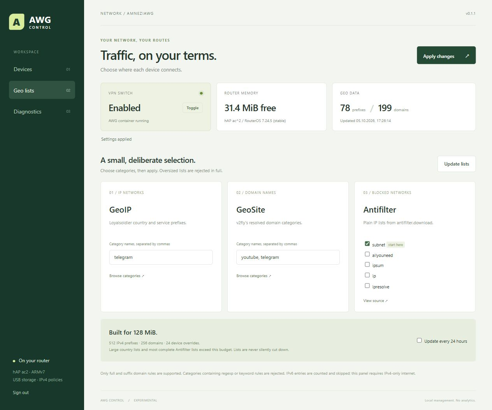

# AWG Control: панель на самом MikroTik

Экспериментальная панель для существующей установки AWG из этого репозитория: устройства, режимы **Direct / Geo / VPN**, выбранные GeoIP/GeoSite/Antifilter-списки, обновление и диагностика. Отдельный контейнер на USB, отдельный адрес `http://192.168.3.1:8088`. Постоянно включённый ПК или NAS не нужен.

**Статус:** панель установлена и запущена на hAP ac² с RouterOS 7.24.5. Проверены вход, чтение DHCP-устройств, REST, повторное применение 78 IPv4-префиксов и 199 доменов (GeoIP Telegram, GeoSite YouTube + Telegram, Antifilter subnet), обновление контейнера с сохранением настроек. На LAN-клиенте подтверждены обычный IP при общем OFF, VPN-IP при ON и обычный IP в индивидуальном Direct при включённом AWG. После применения контейнер занимал около 4,5 MiB, на роутере оставалось около 31 MiB свободной RAM. Это отдельное измерение, не максимальный расход под нагрузкой. Версия остаётся экспериментальной.

Для Geo на том же клиенте проверены воспроизведение YouTube и обычный внешний IP на сайте проверки. На RouterOS появились 30 динамических DNS-адресов; росли счётчики как правил через AWG по спискам, так и правила `main` для остальных назначений. Это проверка выбранного небольшого набора, а не всех категорий источников. Полная перезагрузка роутера и длительный нагрузочный тест после установки панели пока не проводились.

После обновления панели до 0.1.1 повторно проверена физическая Mode рядом с USB: выключение и включение AWG, погасший и загоревшийся USR работают. По завершении проверки исходный режим для всех устройств возвращён на VPN; индивидуальные Direct и Geo доступны в UI.



На скриншоте — работающая панель на MikroTik после применения списков. Также есть [предпросмотр экрана устройств](../docs/media/awg-panel-preview.png) с демонстрационными именами и адресами: он сделан на ПК и не служит подтверждением маршрутизации.

## Почему отдельная страница

Это не плагин WebFig. У hAP ac² с RouterOS 7.24.5 команды `/app/print` и `/app/settings/print` недоступны. WebFig skins меняют существующие элементы, но не предоставляют механизм загрузки произвольной страницы, аналогичный Merlin Addons API.

Внешний вид и сценарий выбора устройств ориентированы на [ASUS-проект](https://github.com/william-aqn/asuswrt-merlin-amneziawg), но сервер и управление RouterOS написаны отдельно. Штатный WebFig остаётся по прежнему адресу; панель открывается на порту 8088.

## Как работают режимы

| Выбор | При включённом AWG |
|---|---|
| Direct | IPv4-интернет через обычный WAN |
| Geo | Адреса из выбранных списков через AWG, остальные — через WAN |
| VPN | Весь IPv4-интернет через AWG |
| Default | Режим для новых и не назначенных отдельно устройств |

Локальные и служебные IPv4-сети остаются в `main`. Назначение хранится по MAC, а не по DHCP-адресу. Список устройств берётся из DHCP; устройство со статическим IP можно добавить вручную по MAC. Смена случайного MAC на телефоне выглядит как новое устройство. Несколько устройств за ещё одним NAT-роутером нельзя разделить по их исходным MAC.

**Mode OFF переводит все устройства на обычный интернет**, включая режим VPN: это сохраняет первоначальное поведение кнопки. «VPN» здесь не означает постоянный запрет интернета при ручном выключении. При включённом AWG резервный blackhole в `to-awg` не даёт отмеченному трафику перейти в `main`, если VPN-маршрут исчезнет.

Mode рядом с USB вызывает прежнюю проверку туннеля через обёртку. Исходный скрипт сохраняется как `awg-toggle-base`; новый `awg-toggle` синхронизирует mangle-политику с общим переключателем. USR продолжает показывать состояние общего AWG-переключателя, а не отдельного устройства и не свежесть handshake.

FastTrack обходится для установленных LAN-соединений. Это нужно, чтобы он не пропускал политику маршрутизации; пропускная способность может снизиться. Скорость этой схемы под нагрузкой пока не измерена.

## Лимиты hAP ac²

У исходного роутера перед установкой панели оставалось около 28 MiB RAM и 372 KiB внутренней flash. USB не увеличивает оперативную память.

| Ресурс | Ограничение |
|---|---|
| Контейнер | `memory-high=12 MiB`, `memory-max=16 MiB` |
| Go | `GOMEMLIMIT=8MiB`, `GOGC=30`, `GOMAXPROCS=1` |
| IPv4-префиксы | 512 уникальных записей суммарно |
| Доменные правила | 256 суммарно |
| Индивидуальные устройства | 24, плюс общий режим |
| Выбранные категории | 12 суммарно |
| Скачивание GeoSite | не больше 48 MiB, потоковая запись на USB |
| Скрипт применения | не больше 60 KB |
| Начало установки | минимум 24 MiB свободной RAM и 160 KiB flash |
| Применение политики | минимум 12 MiB свободной RAM и 160 KiB flash |

Это защитные пределы первой версии, а не измеренная гарантия производительности. Превышение лимита отклоняет весь новый набор; тихого усечения нет. Огромные страновые GeoIP, `geolocation-!cn` и полные Antifilter-списки обычно не помещаются. Панель не пытается загрузить их частично.

Предел 2048 динамических DNS-адресов проверяется раз в минуту. Это **контроль после роста списка**, а не мгновенный жёсткий лимит RouterOS. При превышении панель отключает свои FWD-записи и переводит Geo на весь интернет через VPN до повторного применения. Если панель остановлена, эта периодическая проверка не работает.

## Источники и DNS

* **[Loyalsoldier/geoip](https://github.com/Loyalsoldier/geoip)**: `release/text/<category>.txt`, например `telegram`. IPv4 нормализуется и дедуплицируется. IPv6 считается отдельно и пропускается, поскольку панель управляет IPv4.
* **[v2fly/domain-list-community](https://github.com/v2fly/domain-list-community)**: опубликованный `dlc.dat` с проверкой `.sha256sum`. В нём уже раскрыты include, атрибуты и affiliations. Из файла выбираются только нужные категории; база целиком не загружается в RAM. `RootDomain` становится FWD с `match-subdomain=yes`, `Full` — точным FWD. Категории с `regexp`/`keyword` отклоняются целиком. Фильтры `category@attribute` в UI первой версии не поддерживаются.
* **[Antifilter](https://antifilter.download/)**: текстовые `subnet`, `allyouneed`, `ipsum`, `ip`, `ipresolve`. Для начала подходит небольшой `subnet`; он **не заменяет полный список блокировок**. Чужие `.rsc` не исполняются.

Начать можно с GeoIP `telegram`, GeoSite `telegram` и Antifilter `subnet`. На проверке 5 октября 2026 такой набор дал 78 IPv4-префиксов, 21 домен и 4 пропущенных IPv6-префикса. Размеры источников меняются.

Добавление GeoSite `youtube` дало 199 доменов суммарно. Оба набора успешно загружены и проверены в тестовом контейнере **Linux amd64** с жёстким лимитом 16 MiB без swap и без OOM. Это подтверждает работу загрузчика в ограниченной памяти на ПК, но не заменяет измерение ARM-контейнера и памяти RouterOS с применёнными списками.

GeoSite работает через [RouterOS DNS FWD + address-list](https://manual.mikrotik.com/docs/network-management/dns/). Клиенты должны использовать DNS роутера. DoH в браузере, Android Private DNS, внешний DNS вручную и уже закэшированные на устройстве ответы могут обходить доменное сопоставление. Панель не отключает эти функции на устройствах и не перехватывает их автоматически. Команда `:resolve` на самом MikroTik не заполняет этот список — проверять нужно DNS-запросом от клиента.

DNS общий для всех устройств и сохраняет существующую маршрутизацию DNS через AWG. Direct относится к трафику устройств; отдельного DNS-канала для каждого режима здесь нет. У доменов с общими CDN-IP возможна маршрутизация других доменов через тот же VPN. При пересечении выбранных доменов с существующими DNS Static панель останавливает применение и просит разобрать конфликт.

## Подготовка на компьютере

Нужны Docker и Python 3.10+. Go на хосте для сборки образа не нужен: используется официальный образ Go с закреплённым digest. Скрипты, исходники и сообщения исполняемых файлов — ASCII.

Из корня клонированного репозитория:

```bash
python panel/build.py --output awg-panel.tar
python panel/prepare.py --output awg-panel-private
```

В PowerShell команды такие же. `prepare.py` дважды спросит новый пароль панели длиной не менее 16 символов. Он создаст отдельный случайный пароль служебного RouterOS-пользователя, а пароль панели сохранит только как PBKDF2-SHA256 hash с солью. Пароль администратора MikroTik не требуется на этапе подготовки.

Для другой LAN-подсети /24:

```bash
python panel/prepare.py --lan 192.168.88.0/24 --bridge bridge --disk usb1-part1 --output awg-panel-private
```

Первая версия предполагает адрес шлюза `.1` в этой подсети. Перед импортом нужно проверить эту предпосылку. Временное управление с конкретного ПК за верхним роутером включается отдельно:

```bash
python panel/prepare.py --upstream 192.168.1.50 --wan-address 192.168.1.135 --output awg-panel-private
```

Это пример адреса ПК, а не универсальное разрешение для WAN. Оба адреса должны быть частными. При переходе на настоящего провайдера эти два временных правила нужно убрать; публичный доступ к панели не предусмотрен.

**Не публикуйте `awg-panel-private`:** `settings.json` и `setup.rsc` содержат пароль служебного пользователя. Каталог исключён из Git по умолчанию, но копия с другим именем автоматически исключена не будет. Панель не читает AWG-конфиг, PrivateKey или PresharedKey.

## Установка через WebFig / WinBox

1. Убедитесь, что основная установка AWG уже работает, есть USB ext4, а роутер — hAP ac² с RouterOS 7.24.5. Изучите подготовленный `setup.rsc` и сохраните его `rollback.rsc`. Установщик создаёт ещё один backup на USB.
2. В **Files** создайте каталог `usb1-part1/awg-panel-data`. Перенесите туда `settings.json`. На USB в корень положите `awg-panel.tar`, `setup.rsc` и `rollback.rsc`. Не кладите образ во внутреннюю flash.
3. Проверьте **IP → Services → www**: нужен включённый HTTP на порту 80. Если `Available From` ограничен, добавьте к существующим разрешённым сетям только `172.18.21.2/32`. Скрипт сам не меняет ограничение сервиса. Это внутренний адрес панели, не интернет.
4. Проверьте, что `172.18.21.0/30` свободна, а имена `awg-panel`, `awg-ui-veth`, `awg-toggle-base` не заняты. Импорт не предназначен для повторного запуска поверх частичной установки: сначала нужен откат.
5. В **Terminal** выполните:

```routeros
/import file-name=usb1-part1/setup.rsc verbose=yes
```

`verbose=yes` может показать строки с новым служебным паролем. Не публикуйте этот вывод. Для обычного запуска можно опустить `verbose=yes`.

6. Скрипт ждёт распаковки и запускает панель. Если распаковка не уложилась в две минуты, он остановится с сообщением. После проверки готовности в **Container** запуск можно повторить вручную:

```routeros
/container/start [find where name="awg-panel"]
```

7. Откройте `http://192.168.3.1:8088` из LAN и войдите с **паролем панели**. Если был настроен временный upstream-доступ, используйте соответствующий WAN-адрес с `:8088`.
8. Сначала соберите **Diagnostics**, проверьте свободную память и общий переключатель. После этого выберите небольшой набор списков и один тестовый клиент; только затем назначайте режимы всей сети.

Панель использует HTTP внутри доверенной домашней сети; не открывайте порт 8088 в интернет. В UI есть пароль, сессия HttpOnly/SameSite, проверка Origin и Host, ограничение попыток входа. HTTPS-терминатор и публичное управление в эту версию не входят.

Служебный пользователь ограничен входом с `172.18.21.2/32`, без SSH/WinBox/управления пользователями, с `read,write,test,api,rest-api`. RouterOS не позволяет ограничить `write` только префиксом `AWG3UI`: эти права дают панели возможность изменять сеть роутера. Поэтому код панели и её пароль входят в доверенную часть управления.

### Нюансы, найденные на реальном роутере

* Для REST требуются **оба** права `api` и `rest-api`. Без `api` вход по HTTP проходит, но команды возвращают `std failure: not allowed (9)`.
* При импорте нельзя рассчитывать, что повторный `place-before=0` каждый раз означает новый первый элемент. Разрешения панели вставляются перед конкретными правилами `AWG3UI input guard` и `AWG3UI access guard`, иначе блокирующее правило может оказаться выше разрешений.
* Для `/ip/firewall/address-list/add` используется `dynamic=yes`: записи остаются в RAM и исчезают после перезагрузки. `timeout=none-dynamic` здесь отклоняется; это значение относится к `address-list-timeout` в действиях firewall.
* Две FWD-записи с одинаковым именем и типом вызывают `entry already exists`. Во время применения готовность Geo временно снимается, прежние FWD удаляются и заменяются новым набором. При ошибке Geo остаётся целиком через VPN до успешного восстановления.
* `import ... dry-run` проверяет синтаксис, но не подтверждает успешное выполнение. Для runtime-ошибок панель сохраняет исходное сообщение RouterOS и диагностический снимок на USB.

## Применение, перезапуск и ошибки

Обновление самого контейнера делается отдельно от **Update lists**. Соберите новый `awg-panel.tar` на компьютере и загрузите его на USB. Остановите только панель:

```routeros
/container/stop [find where name="awg-panel"]
```

Дождитесь состояния `stopped` в **Container**, затем обновите образ:

```routeros
/container/repull [find where name="awg-panel"] file=usb1-part1/awg-panel.tar
```

После завершения распаковки запустите панель:

```routeros
/container/start [find where name="awg-panel"]
```

Каталог `awg-panel-data` с настройками сохраняется. Повторный импорт `setup.rsc` для обновления не нужен. После рестарта потребуется снова войти в панель; существующий AWG-контейнер не перезапускается.

Панель сохраняет желаемое состояние и проверенный снимок списков на USB. Новые IP и правила создаются в неактивной группе `a`/`b`, затем переключается один вход в mangle. Старые IP и mangle удаляются после переключения. FWD-записи заменяются раньше, под временной защитой Geo через весь VPN: RouterOS запрещает дублировать имена между группами. При смене правил очищаются соединения LAN и DNS-кэш: текущие соединения могут на короткое время прерваться.

На время применения снимается флаг готовности Geo. Устройства Geo используют VPN целиком; Direct продолжает идти напрямую. После успешного завершения возвращается обычный выбор по спискам. Если ошибка произошла после переключения, Geo остаётся в этом защитном режиме до восстановления — это не обещание полного автоматического отката каждой команды RouterOS.

IP-списки и флаг готовности хранятся в RAM RouterOS (`dynamic=yes`); после перезагрузки панель восстанавливает их с USB. Доменные FWD и небольшие правила mangle сохраняются в настройках RouterOS. До восстановления Geo уходит через VPN, когда общий переключатель включён. При ручном Mode OFF действует обычный WAN.

При неудачном скачивании прежние правила остаются. Автообновление — раз в 24 часа; повтор после ошибки — не чаще раза в час. Текущая ошибка видна в UI, снимок диагностики сохраняется на USB в `awg-panel-data/last-error.json`.

**Diagnostics** не запрашивает пароли, исходники скриптов или содержимое AWG-конфига. Там остаются локальные адреса и технические сведения; перед публикацией отчёт нужно просмотреть. Если UI недоступен, через терминал:

```routeros
/container/print detail where name="awg-panel"
/log/print where message~"AWG3UI|AWG panel"
/system/resource/print
/ip/firewall/mangle/print stats where comment~"^AWG3UI "
```

Для запуска встроенной диагностики прямо в контейнере:

```routeros
/container/shell [find where name="awg-panel"] cmd="/awg-panel --diag" no-sh
```

Если даже контейнер не запускается, смотрите RouterOS log и `memory-current`; повторный старт при недостатке RAM не устраняет причину.

## Обновление и удаление

Обновление самого образа выполняется вручную через `stop` → `repull file=...` → `start`, как показано выше. Сначала сохраните копию `awg-panel-data`. Не запускайте `setup.rsc` повторно и не удаляйте каталог данных. Автоматический updater образа пока не реализован.

Полное снятие панели:

```routeros
/import file-name=usb1-part1/rollback.rsc
```

Откат останавливает контейнер, восстанавливает исходный `awg-toggle`, убирает свои правила, VETH и служебного пользователя. Основной контейнер `awg3`, конфиг VPN и файлы на USB сохраняются. Если вручную добавляли `172.18.21.2/32` в ограничение www, удалите только это добавление отдельно.

## Проверки разработчика

```bash
python -B -m unittest discover -s tests -v
python tools/verify_repo.py
cd panel
go test -race ./...
go vet ./...
go run . --demo
```

Последняя команда открывает сервер предпросмотра на `127.0.0.1:9865`. Он работает с демонстрационными данными и не подключается к RouterOS. Не используйте `--demo` для развёртывания на роутере.

Проверены разбор protobuf с разным порядком полей, повреждённые данные, лимиты, отказ от неподдерживаемых правил, Direct/Geo/VPN и режим до готовности списков, CSRF/Host/сессии, ошибки REST и подготовка ограниченного доступа. Тесты не подменяют проверку с LAN-клиентом и реальными DNS-запросами на MikroTik.

Справка: [RouterOS REST API](https://manual.mikrotik.com/docs/developer-guides/rest-api/), [списки адресов](https://manual.mikrotik.com/docs/firewall-and-quality-of-service/firewall/address-lists/), [контейнеры](https://manual.mikrotik.com/docs/containers/), [WebFig skins](https://help.mikrotik.com/docs/spaces/ROS/pages/328131/WebFig).
