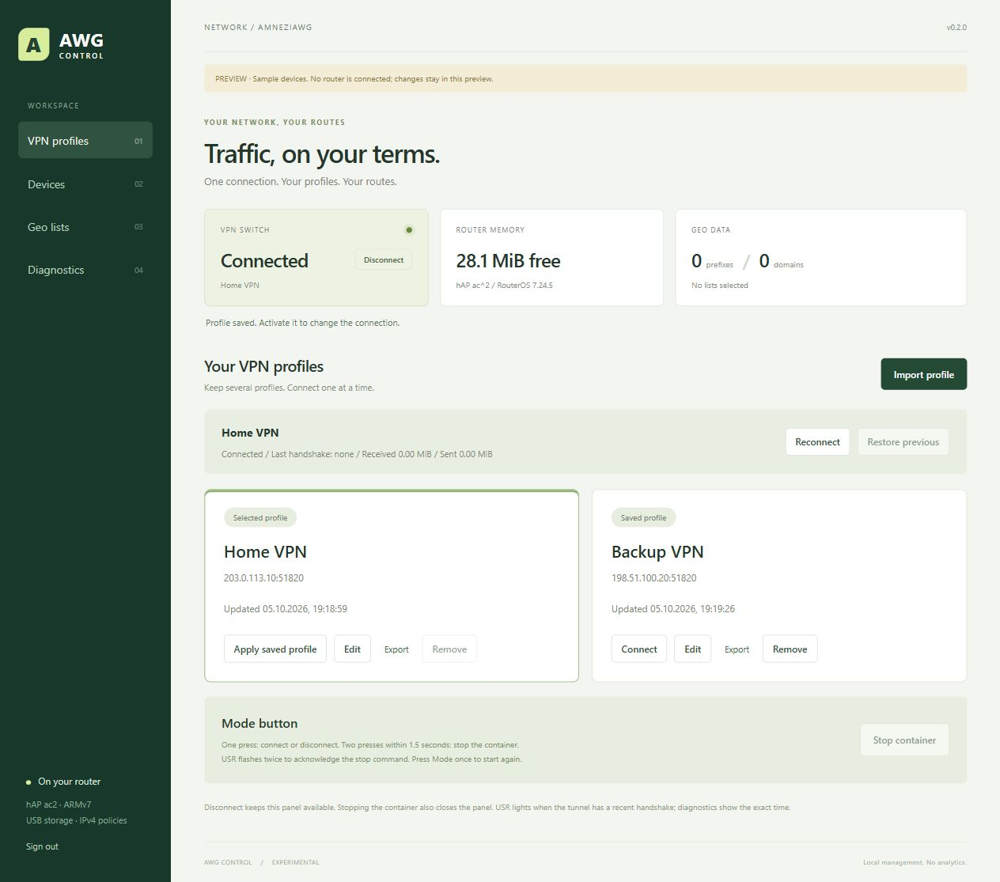

# AWG Control 0.2: VPN и панель в одном контейнере

Самостоятельный экспериментальный проект для **hAP ac², ARMv7, RouterOS 7.24.5 stable**. Один контейнер объединяет панель и движок AmneziaWG. На USB хранится несколько профилей, активен только один. Отключение VPN оставляет панель доступной по `http://192.168.3.1:8088` (адрес LAN-шлюза из примера).

Это отдельная страница, а не пункт WebFig. Пароль панели при миграции сохраняется.



На скриншоте локальный предпросмотр с вымышленными профилями; реальные адреса и ключи в репозиторий не включены.

## Профили и соединение

**VPN profiles → Import profile**: выберите нативный `.conf` AmneziaWG или вставьте его текст, укажите имя, нажмите **Save profile**. Сохранение не меняет текущее соединение. Нажмите **Connect** на нужной карточке, чтобы переключиться.

Доступны редактор полного конфига, отдельные поля сервера/DNS/MTU, экспорт, переподключение и **Restore previous**. Изменения через **Edit → Save** становятся активными только после **Apply saved profile**. Откат использует снимок прежнего подключения, включая параметры, а не просто имя профиля.

Новый профиль проверяется по handshake, полученным байтам и TCP-доступу к `1.1.1.1:443` в течение 35 секунд. При ошибке контроллер пытается восстановить прежнее подключение. Если первый профиль не подключился, отмеченный VPN-трафик остаётся заблокированным до явного **Disconnect** или повторной попытки. При неожиданном завершении во время смены профиля следующий запуск выбирает последний сохранённый профиль.

До 16 профилей по 16 KiB; один Interface, один Peer, IPv4-адрес туннеля и полный IPv4-маршрут в AllowedIPs. Параметры AWG3 сохраняются: S1–S4, диапазоны H1–H4, I1–I5, HeaderProtectionKey, ContentPaddingAddition, таймеры и диапазоны PersistentKeepalive. Исполняемые PreUp/PostUp/PreDown/PostDown, Table, FwMark и неизвестные поля отклоняются. IPv6-записи можно сохранить в тексте, но маршрутизация этой версии — только IPv4.

Ключи хранятся на USB и видны при явном открытии редактора/экспорте. Их нет в карточках и диагностике. Активный профиль и профиль для отката удалить нельзя.

## Mode и два мигания USR

Используется **Mode рядом с USB**, не кнопка рядом с питанием.

| Действие | Результат |
|---|---|
| Одно нажатие, VPN подключён | Отключение туннеля; панель работает |
| Одно нажатие, VPN отключён или потерял связь | Подключение выбранного профиля |
| Одно нажатие, контейнер остановлен | Запуск контейнера и подключение |
| Два нажатия в пределах 1,5 секунды | Полная остановка контейнера |
| Два коротких мигания USR | Команда полной остановки принята |
| USR горит | У выбранного туннеля есть недавний handshake |
| USR погас | Соединение отключено, не подтверждено или контейнер остановлен |

Одиночное нажатие обрабатывается с задержкой 1,5 секунды. При двойном сначала гасится прежний свет, затем идут два импульса по 150 мс; после остановки USR остаётся выключенным. Панель не обновляет индикатор, пока выполняется обработчик Mode.

RouterOS на проверенном устройстве предоставляет один обработчик с диапазоном hold-time, но не передаёт ему длительность нажатия. Поэтому второе действие назначено на двойное, а не длительное нажатие.

Свежесть handshake проверяется раз в 5 секунд; окно зависит от RejectAfterTime и составляет минимум 240 секунд. USR не означает непрерывную проверку каждого сайта. В UI видны точное время handshake и RX/TX.

Полная остановка выключает start-on-boot. Одиночная Mode снова включает автозапуск. Альтернатива: **WebFig → Container → awg-control → Start**, затем **Connect** в панели. Кнопка **Stop container** в UI также полностью останавливает контейнер, поэтому сама страница станет недоступна.

## Установка из репозитория

Нужны Python 3.10+, Docker, SSH/SFTP к MikroTik, пакет container версии 7.24.5, container=yes и routerboard=yes в device-mode, USB ext4 и работающий обычный интернет. Мастер не обновляет RouterOS и не форматирует флешку.

Из корня клонированного репозитория на компьютере:

```sh
python -m venv .venv
```

Linux/macOS:

```sh
.venv/bin/python -m pip install paramiko==4.0.0
.venv/bin/python panel/install.py
```

Windows PowerShell:

```powershell
.venv\Scripts\python.exe -m pip install paramiko==4.0.0
.venv\Scripts\python.exe panel/install.py
```

Мастер спрашивает адрес и пароль MikroTik, LAN, bridge, USB и пароль панели. Пароль MikroTik не сохраняется. При первом SSH-подключении показывает отпечаток ключа сервера. Образ собирается локально из закреплённых исходников и образов. Перед изменениями показывается подготовленная установка и запрашивается подтверждение. После новой установки импортируйте профиль в UI и нажмите Connect. Панель открывается только из LAN.

**Корневые install.sh, install.ps1 и awg-mikrotik.py пока устанавливают прежний awg3 без объединённой панели. Для 0.2 используйте panel/install.py.** Все исполняемые исходники и сообщения мастера — ASCII.

Диагностика и откат:

```sh
python panel/install.py --diag --host 192.168.3.1
python panel/install.py --rollback awg-control-run-YYYYMMDD-HHMMSS --host 192.168.3.1
```

При ошибке диагностика автоматически печатается и сохраняется. Частично выполненная установка не запускается повторно поверх существующих объектов. Каталог запуска содержит приватные файлы и скрипт отката, привязанный к адресу роутера: не публикуйте его.

## Переход с двух контейнеров 0.1.1

Для существующих awg3 + awg-panel из этого репозитория:

```sh
python panel/install.py --migrate --host 192.168.3.1
```

Перед запуском включите прежний VPN. Мастер получает по SFTP настройки панели, её списки и `USB/wg/awg0.conf`. Пароль панели, служебный пароль и имя awg-panel сохраняются: RouterOS не позволяет переименовать пользователя. Меняется только разрешённый адрес нового контейнера.

Старые контейнеры останавливаются и исключаются из автозапуска. Старый AWG получает отдельный неиспользуемый VETH, освобождая прежний интерфейс. Старые правила отключаются с сохранением исходного состояния в комментариях; их файлы и корневые каталоги не удаляются.

Откат возвращает прежние правила, адрес служебного пользователя, интерфейс контейнера, Mode и LED-планировщик. Файлы новой версии сохраняются для разбора. На время миграции нужен доступ к роутеру, не зависящий от VPN. Автоматический мастер использует LAN-доступ; для временного доступа из вышестоящей домашней сети используйте ручной пакет с параметрами ниже.

## Сборка и ручная установка

```sh
python panel/build.py --output awg-control.tar
python panel/prepare.py --output awg-control-private
```

prepare.py ничего не меняет на роутере: создаёт settings.json, setup.rsc, rollback.rsc. Для ручной миграции добавьте `--migrate-from` с прежним приватным settings.json; отдельно нужно перенести state.json и профиль. Проще использовать мастер выше.

Для одного ПК за домашним роутером доступны `--upstream 192.168.1.109 --wan-address 192.168.1.135`. Это не открывает панель всему WAN. При прямом подключении к провайдеру используйте LAN.

Загрузите образ как `usb1-part1/awg-control.tar`, настройки как `usb1-part1/awg-control-data/settings.json`, скрипты как `usb1-part1/awg-control-setup.rsc` и `usb1-part1/awg-control-rollback.rsc`. В Terminal WebFig/WinBox:

```routeros
/import file-name=usb1-part1/awg-control-setup.rsc
```

Управление работающим контроллером:

```routeros
/container/shell [/container/find where name="awg-control"] cmd="/awg-control --control diag" no-sh
/container/shell [/container/find where name="awg-control"] cmd="/awg-control --control disconnect" no-sh
/container/shell [/container/find where name="awg-control"] cmd="/awg-control --control connect" no-sh
/container/shell [/container/find where name="awg-control"] cmd="/awg-control --control restart" no-sh
```

Команда возвращает принятие запроса; итог виден в UI/диагностике. Ошибки подключения сохраняются в last-error.json на USB. Для отката через терминал:

```routeros
/import file-name=usb1-part1/awg-control-rollback.rsc
```

## Маршруты и ограничения

| Режим устройства | При подключённом VPN |
|---|---|
| Direct | Интернет через WAN |
| Geo | Выбранные IP/домены через AWG, остальное через WAN |
| VPN | Весь IPv4-интернет через AWG |
| Default | Общий режим для устройств без назначения |

**Явный Disconnect и полная остановка переводят устройства на обычный интернет.** При неудачном подключении или внезапном падении движка отмеченный трафик не должен обходить VPN: FORWARD контейнера по умолчанию DROP, в to-awg есть резервный blackhole. Локальные IPv4-сети доступны напрямую. FastTrack обходится для LAN; скорость под нагрузкой ещё не измерена.

Управление RouterOS REST идёт по единственному VETH `172.18.20.2/30 → 172.18.20.1`. Наружу контейнеру разрешён только UDP к VPN endpoint. Geo-источники скачиваются через подключённый VPN. При выключенном VPN можно применить сохранённый снимок списков, но не скачать новый.

Для endpoint с доменным именем сохраняется последний разрешённый публичный IPv4: он позволяет запуститься, если DNS роутера сам направлен в ещё не поднятый VPN. При смене IP сервера и недоступном DNS сначала используйте Disconnect, затем Connect.

DNS общий для устройств; при VPN используется DNS профиля. GeoSite работает через RouterOS DNS FWD/address-list: клиентам нужен DNS роутера. DoH, Android Private DNS и сторонний DNS могут обходить доменные правила. Общие CDN-IP иногда направляют через VPN другие домены. Клиентов за дополнительным NAT нельзя разделить по исходным MAC.

### Исправление DNS в ранней установке 0.2

Если VPN подключён, но сайты не открываются, в первой установке 0.2 могло отсутствовать правило `AWGC router replies`. Из-за этого `AWGC input guard` блокировал ответы DNS, которые роутер запрашивал через туннель. Установщик исправлен; для уже установленной версии выполните в Terminal WebFig/WinBox:

```routeros
:if ([:len [/ip/firewall/filter/find where comment="AWGC router replies"]] = 0) do={
    /ip/firewall/filter/add chain=input in-interface=docker-awg-veth connection-state=established,related action=accept comment="AWGC router replies" place-before=[find where comment="AWGC input guard"]
}
/ip/dns/cache/flush
:put [:resolve "example.com"]
```

Правило пропускает ответы на отслеживаемые соединения роутера перед блокирующим правилом. Новые входящие соединения из контейнера по-прежнему ограничены API и DNS. Перезапуск контейнера не нужен. Проверка handshake в панели сама по себе не проверяет DNS клиентов; после установки откройте сайты с устройства за MikroTik.

| Ресурс | Предел |
|---|---|
| Профили | 16 по 16 KiB, один активный |
| IPv4-префиксы / домены | 512 / 256 суммарно |
| Устройства / категории источников | 24 / 12 |
| Контейнер | memory-high 24 MiB, memory-max 32 MiB |
| Go: контроллер / движок | GOMEMLIMIT 8 / 12 MiB |

Go-лимиты — мягкие цели сборщика мусора, а не гарантия общего расхода RAM. Динамические DNS-адреса проверяются раз в минуту: при превышении 2048 Geo временно переводится на весь интернет через VPN. Это контроль после роста, а не мгновенный жёсткий предел. Слишком большие списки отклоняются целиком, не обрезаются молча. Активный IPv6-интернет блокирует установку.

Источники: [Loyalsoldier/geoip](https://github.com/Loyalsoldier/geoip), [v2fly/domain-list-community](https://github.com/v2fly/domain-list-community), [Antifilter](https://antifilter.download/). GeoSite читается потоком с USB и проверяется по опубликованной SHA256. Regexp/keyword-категории отклоняются. Чужие RSC из источников не исполняются.

## Проверки и происхождение

0.2 установлена на hAP ac²: один новый контейнер запущен, профиль подключён, handshake и RX/TX подтверждены; 78 префиксов и 199 доменов перенесены. Панель показывала около 31 MiB свободной RAM — это снимок, не максимум под нагрузкой. Обработчик Mode проверен вызовами RouterOS: двойной вызов подтверждается журналом, контейнер останавливается, USR становится off; следующий одиночный вызов запускает контейнер и восстанавливает handshake. Визуальное подтверждение двух вспышек на корпусе и клиентские IP после миграции требуют проверки пользователем.

Локально проверены импорт, валидация, отсутствие ключей в списке/диагностике, откат неудачной активации, восстановление прерванной операции и запуск/остановка настоящего движка через Unix UAPI в Linux amd64. ARM-образ собран и запущен на роутере. Полная перезагрузка устройства, длительная нагрузка и новая установка мастером на чистый роутер ещё не проверены. Windows-прогон Go-тестов на рабочем ПК иногда завершается ошибкой удаления временной папки; соответствующие тесты на Linux проходят.

Контроллер и UI написаны здесь. Движок — [amnezia-vpn/amneziawg-go](https://github.com/amnezia-vpn/amneziawg-go), commit `b5928efb6ca19f0153958460c3d141f04abc5c2e`; его лицензия включена в образ. Начальная работа опиралась на [catesin/AmneziaWG-MikroTik](https://github.com/catesin/AmneziaWG-MikroTik). В 0.2 собственный контроллер заменяет запуск всех конфигов и вторую панель-надстройку. [История двухконтейнерной 0.1.1](../docs/panel-0.1.1.md).
